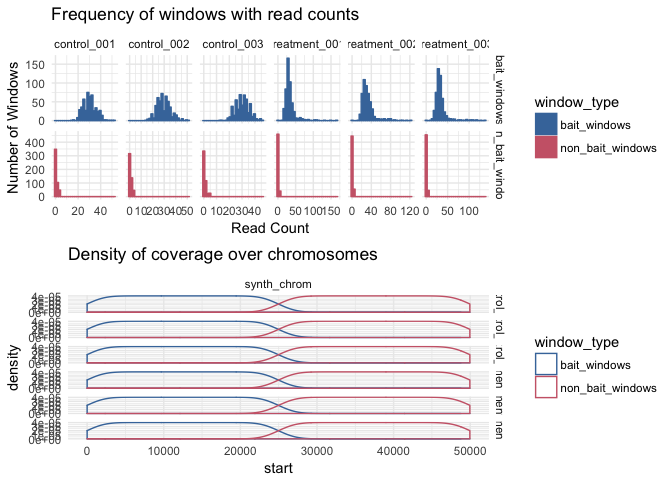

<!-- README.md is generated from README.Rmd. Please edit that file -->
atacr
=====

atacr helps with the analysis of count data from ATAC-seq experiments. Using BioConductor RangedSummarizedExperiment objects, atacr implements a set of helper functions and quality control plots specific to the analysis of particularly windows. Especially, atacr is useful for performing control window based normalisations and for easily running tests for differentially accessible windows in common reference designs with multiclass data.

Installation
------------

You can install atacr from github with:

``` r
# install.packages("devtools")
devtools::install_github("TeamMacLean/atacr")
```

Example
-------

This is a basic example which shows you how to solve a common problem:

``` r
library(atacr)
summary(sim_counts)
#> ATAC-seq experiment of 2 treatments in 6 samples
#>  Treatments: control,treatment 
#>  Samples: control_001,control_002,control_003,treatment_001,treatment_002,treatment_003 
#>  Bait regions used: 500 
#>  Total Windows: 1000 
#>  
#>  On/Off target read counts:
#>           sample off_target on_target percent_on_target
#> 1   control_001        312     15160          97.98345
#> 2   control_002        347     14777          97.70563
#> 3   control_003        339     15115          97.80639
#> 4 treatment_001        321     16955          98.14193
#> 5 treatment_002        346     16490          97.94488
#> 6 treatment_003        335     17064          98.07460 
#>  Quantiles: 
#>  $bait_windows
#>     control_001 control_002 control_003 treatment_001 treatment_002
#> 1%        19.99       16.99          19         16.99         16.00
#> 5%        22.00       20.00          22         20.00         19.00
#> 95%       40.00       40.00          39         63.00         65.05
#> 99%       45.00       46.00          44        109.00         89.03
#>     treatment_003
#> 1%          16.00
#> 5%          21.00
#> 95%         61.00
#> 99%        109.06
#> 
#> $non_bait_windows
#>     control_001 control_002 control_003 treatment_001 treatment_002
#> 1%            0           0        0.00             0          0.00
#> 5%            0           0        0.00             0          0.00
#> 95%           3           4        3.05             3          3.05
#> 99%           4           4        4.00             4          4.00
#>     treatment_003
#> 1%              0
#> 5%              0
#> 95%             3
#> 99%             4
#>  
#>  Read depths:
#>           sample off_target on_target
#> 1   control_001      0.624    30.320
#> 2   control_002      0.694    29.554
#> 3   control_003      0.678    30.230
#> 4 treatment_001      0.642    33.910
#> 5 treatment_002      0.692    32.980
#> 6 treatment_003      0.670    34.128
```

``` r
plot(sim_counts)
#> `stat_bin()` using `bins = 30`. Pick better value with `binwidth`.
```


