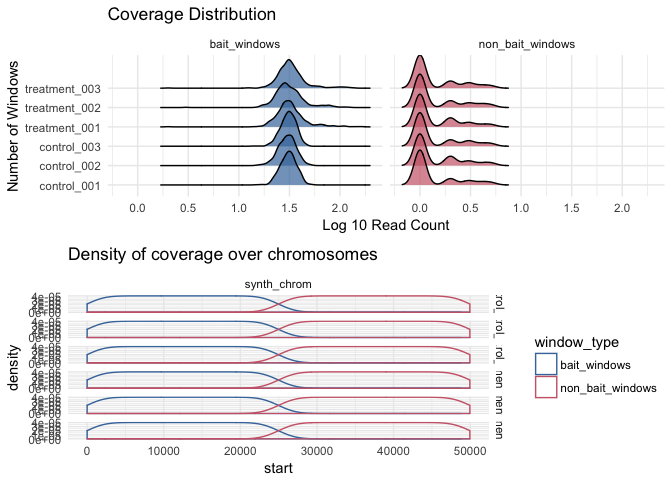

[](http://www.repostatus.org/#active)
[](https://www.gnu.org/licenses/gpl-3.0.en.html)
[](https://travis-ci.org/TeamMacLean/atacr)
[](https://codecov.io/gh/TeamMacLean/atacr)
 
---
 
[](https://cran.r-project.org/)
[](https://cran.r-project.org/package=atacr)
[](commits/master)
 
---
 
[)`-yellowgreen.svg)](/commits/master)


<!-- README.md is generated from README.Rmd. Please edit that file -->
atacr
=====

atacr helps with the analysis of count data from ATAC-seq experiments. Using BioConductor RangedSummarizedExperiment objects, atacr implements a set of helper functions and quality control plots specific to the analysis of particularly windows. Especially, atacr is useful for performing control window based normalisations and for easily running tests for differentially accessible windows in common reference designs with multiclass data.

Installation
------------

You can install atacr from github with:

``` r
# install.packages("devtools")
devtools::install_github("TeamMacLean/atacr")
```

Example
-------

This is a basic example which shows you how to solve a common problem:

``` r
library(atacr)
summary(sim_counts)
#> ATAC-seq experiment of 2 treatments in 6 samples
#>  Treatments: control,treatment 
#>  Samples: control_001,control_002,control_003,treatment_001,treatment_002,treatment_003 
#>  Bait regions used: 500 
#>  Total Windows: 1000 
#>  
#>  On/Off target read counts:
#>           sample off_target on_target percent_on_target
#> 1   control_001        355  15001.00          97.68820
#> 2   control_002        359  15170.00          97.68820
#> 3   control_003        360  14976.00          97.65258
#> 4 treatment_001        364  16665.77          97.86257
#> 5 treatment_002        405  16755.63          97.63995
#> 6 treatment_003        376  16640.31          97.79036 
#>  Quantiles: 
#>  $bait_windows
#>     control_001 control_002 control_003 treatment_001 treatment_002
#> 1%        18.99       18.00       18.00      16.99631      15.82787
#> 5%        22.00       21.95       20.95      19.68127      21.01409
#> 95%       40.00       40.00       39.00      61.10000      60.00000
#> 99%       43.00       44.01       44.00     115.12000     113.04000
#>     treatment_003
#> 1%       15.67291
#> 5%       19.27702
#> 95%      62.10000
#> 99%     111.03000
#> 
#> $non_bait_windows
#>     control_001 control_002 control_003 treatment_001 treatment_002
#> 1%            0           0           0             0             0
#> 5%            0           0           0             0             0
#> 95%           3           4           3             4             4
#> 99%           4           4           4             4             4
#>     treatment_003
#> 1%              0
#> 5%              0
#> 95%             4
#> 99%             4
#>  
#>  Read depths:
#>           sample off_target on_target
#> 1   control_001      0.710  30.00200
#> 2   control_002      0.718  30.34000
#> 3   control_003      0.720  29.95200
#> 4 treatment_001      0.728  33.33155
#> 5 treatment_002      0.810  33.51125
#> 6 treatment_003      0.752  33.28062
```

``` r
plot(sim_counts)
#> `stat_bin()` using `bins = 30`. Pick better value with `binwidth`.
```


